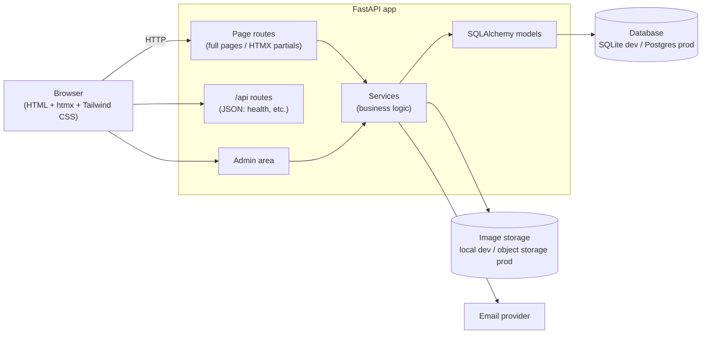
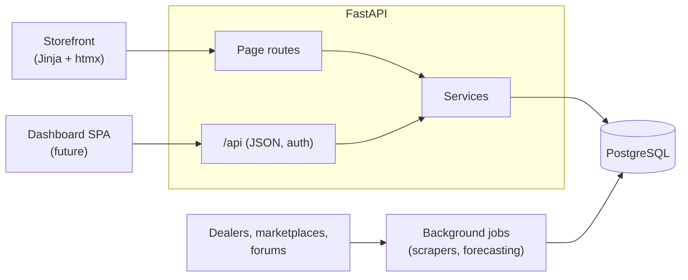

# Architecture

## Overview

A single server-rendered Python web app. FastAPI renders HTML with Jinja templates; HTMX swaps
page fragments for app-like interactions without a JavaScript framework. One codebase, one
deployable.



## Stack and rationale

| Layer | Choice | Why |
| --- | --- | --- |
| Web framework | **FastAPI** | Modern async Python, type hints end to end, auto-generated API docs at `/docs`. |
| Templates | **Jinja2** | Server-rendered HTML is fast on low-end phones and fully indexable by search engines. |
| Interactivity | **htmx** (+ Alpine.js only if needed) | About 14 KB of JS instead of a React bundle. Partial page updates (filters, forms) with no build step. |
| Styling | **Tailwind CSS** (standalone CLI) | Fast to build a polished, responsive UI; the standalone binary means no Node.js. |
| Database | **SQLAlchemy 2.0 + Alembic** on SQLite (dev) / PostgreSQL (prod) | Typed ORM, versioned migrations, zero setup locally. |
| Admin | **SQLAdmin** (tentative, decide in Sprint 3) | Django-style admin panel for SQLAlchemy models; avoids hand-building inventory CRUD. |
| Package mgmt | **uv** | Fast, reproducible installs via `uv.lock`. |
| Quality | **Ruff** (lint + format), **pytest**, GitHub Actions CI | Every PR is linted and tested automatically. |

## Code layout

```
app/
  main.py        # App factory: mounts static files, registers routers
  config.py      # Settings from environment variables (MAKARIOS_*)
  paths.py       # Filesystem paths + shared Jinja templates object
  routes/
    pages.py     # HTML routes (full pages and HTMX partials)
    api.py       # JSON routes under /api
  templates/
    base.html    # Shared layout
    pages/       # Full-page templates
    partials/    # Fragments returned to HTMX requests
  static/        # Served at /static
    css/         #   input.css (source) + app.css (generated, committed)
    js/          #   htmx, vendored
    fonts/       #   self-hosted display serif, subset
    img/         #   brand assets and generated placeholders
tests/           # pytest suite
scripts/         # Developer tooling: CSS build, asset generators
design/          # Source logos and photography (see docs/BRAND.md)
docs/            # MVP, architecture, brand, workflow, sprint notes
```

Added as the project grows: `app/models/` (database models), `app/services/` (business logic,
kept out of routes so it's testable), `app/db.py` (engine and session).

## Conventions

- **Routes stay thin.** They parse the request, call a service, and render a template.
- **One URL, two responses.** A page route returns the full page normally, and only the
  changed fragment when the request has the `HX-Request` header.
- **Progressive enhancement.** Links and forms work without JavaScript; htmx makes them smoother.

## Performance strategy

Speed on mobile is the top product priority, and for a watch site **images dominate page weight**.

- Generate resized WebP/AVIF variants on upload; serve with `srcset`/`sizes` so phones download
  phone-sized images.
- `loading="lazy"` on below-the-fold images; explicit `width`/`height` to prevent layout shift.
- Minified Tailwind CSS containing only used classes; htmx is the only required script.
- Long cache headers on static assets (fingerprinted filenames).
- **Everything is same-origin.** htmx is vendored and the display serif is self-hosted and subset
  to Latin, so no page needs a connection to a third-party origin before it can render.
- The font is preloaded, since the browser otherwise only discovers it after parsing the CSS.
- Headings size with `clamp()` rather than breakpoint variants: fluid on every screen, and one
  less thing to keep in sync.

## Open decisions

| Decision | Target sprint |
| --- | --- |
| Admin approach: SQLAdmin vs. hand-built pages | Sprint 3 |
| Hosting (Render / Railway / Fly.io) and Postgres provider | Sprint 3 |
| Image storage in production (e.g. Cloudflare R2, S3) | Sprint 4 |
| Transactional email provider | Sprint 5 |
| Dashboard frontend stack (React + TypeScript vs. a lighter option such as Preact or Svelte) | After the MVP |

## Future: internal dashboard

The long-term goal goes beyond the storefront. The plan is a private dashboard for the owner and
their business partner. It would pull in inventory from the places watches are sourced (dealers,
local and online marketplaces, forums), then analyze the data, forecast, and track business KPIs.

The storefront and the dashboard have opposite needs, so each gets its own frontend. **One FastAPI
backend serves both.**

| | Storefront (public) | Dashboard (private) |
| --- | --- | --- |
| Users | Buyers, mostly on phones | Owner and partner, logged in |
| Priorities | First-load speed, SEO, images | Dense tables, charts, filters, interactivity |
| Frontend | Jinja + htmx + Tailwind (this app) | Single-page app (SPA), stack still to be decided |
| Talks to backend via | Server-rendered HTML | JSON from `/api` (authenticated) |



Scraping, analysis, and forecasting stay in Python as background jobs, apart from the web
requests. Adding the dashboard therefore means adding a frontend and JSON endpoints; the backend
doesn't need rebuilding. The storefront stays server-rendered because a JavaScript bundle would cost
mobile speed and SEO for no gain there. Design tools that export HTML + Tailwind (such as Google
Stitch) work for both: their output drops into Jinja templates as-is, or ports to components later.

