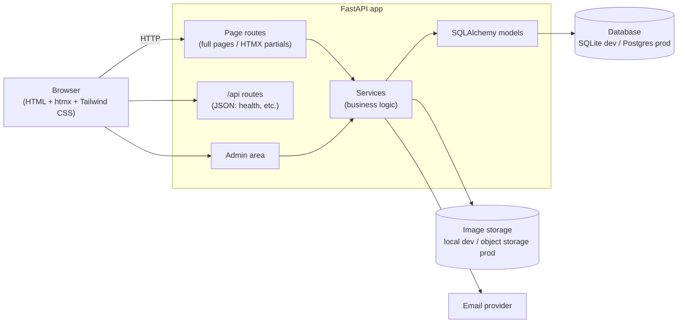

# Architecture

## Overview

A single server-rendered Python web app. FastAPI renders HTML with Jinja templates; HTMX swaps
page fragments for app-like interactions without a JavaScript framework. One codebase, one
deployable.



## Stack and rationale

| Layer | Choice | Why |
| --- | --- | --- |
| Web framework | **FastAPI** | Modern async Python, type hints end to end, auto-generated API docs at `/docs`. |
| Templates | **Jinja2** | Server-rendered HTML is fast on low-end phones and fully indexable by search engines. |
| Interactivity | **htmx** (+ Alpine.js only if needed) | About 14 KB of JS instead of a React bundle. Partial page updates (filters, forms) with no build step. |
| Styling | **Tailwind CSS** (standalone CLI) | Fast to build a polished, responsive UI; the standalone binary means no Node.js. |
| Database | **SQLAlchemy 2.0 + Alembic** on SQLite (dev) / PostgreSQL (prod) | Typed ORM, versioned migrations, zero setup locally. |
| Admin | **SQLAdmin** (tentative, decide in Sprint 3) | Django-style admin panel for SQLAlchemy models; avoids hand-building inventory CRUD. |
| Package mgmt | **uv** | Fast, reproducible installs via `uv.lock`. |
| Quality | **Ruff** (lint + format), **pytest**, GitHub Actions CI | Every PR is linted and tested automatically. |

## Code layout

```
app/
  main.py        # App factory: mounts static files, registers routers
  config.py      # Settings from environment variables (MAKARIOS_*)
  paths.py       # Filesystem paths + shared Jinja templates object
  routes/
    pages.py     # HTML routes (full pages and HTMX partials)
    api.py       # JSON routes under /api
  templates/
    base.html    # Shared layout
    pages/       # Full-page templates
    partials/    # Fragments returned to HTMX requests
  static/        # CSS, JS, images served at /static
tests/           # pytest suite
docs/            # MVP, architecture, workflow, sprint notes
```

Added as the project grows: `app/models/` (database models), `app/services/` (business logic,
kept out of routes so it's testable), `app/db.py` (engine and session).

## Conventions

- **Routes stay thin.** They parse the request, call a service, and render a template.
- **One URL, two responses.** A page route returns the full page normally, and only the
  changed fragment when the request has the `HX-Request` header.
- **Progressive enhancement.** Links and forms work without JavaScript; htmx makes them smoother.

## Performance strategy

Speed on mobile is the top product priority, and for a watch site **images dominate page weight**.

- Generate resized WebP/AVIF variants on upload; serve with `srcset`/`sizes` so phones download
  phone-sized images.
- `loading="lazy"` on below-the-fold images; explicit `width`/`height` to prevent layout shift.
- Minified Tailwind CSS containing only used classes; htmx is the only required script.
- Long cache headers on static assets (fingerprinted filenames).

## Open decisions

| Decision | Target sprint |
| --- | --- |
| Admin approach: SQLAdmin vs. hand-built pages | Sprint 3 |
| Hosting (Render / Railway / Fly.io) and Postgres provider | Sprint 3 |
| Image storage in production (e.g. Cloudflare R2, S3) | Sprint 4 |
| Transactional email provider | Sprint 5 |

